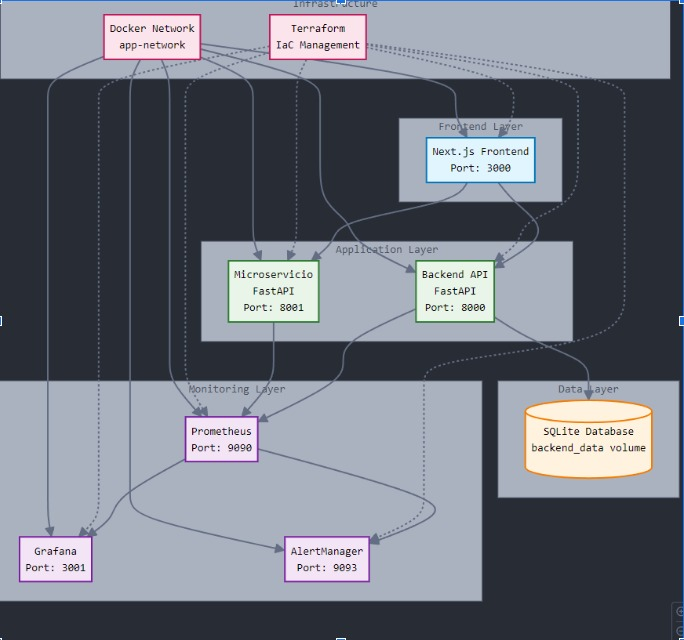

# 🧠 TPI DevOps - Sistema Monitoreado con Microservicios


---

## ✨ Características Principales

- 🎯 **Arquitectura de Microservicios** - Sistema distribuido y escalable
- 📊 **Monitoreo en Tiempo Real** - Prometheus + Grafana + Alertmanager
- 🌩️ **API de Clima Inteligente** - Microservicio con historial y métricas
- 🚀 **Despliegue Automatizado** - Docker Compose + Terraform
- ☁️ **Cloud Ready** - Desplegable en Google Cloud Platform
- 📱 **Frontend Moderno** - Next.js con Tailwind CSS

---

## 🛠️ Stack Tecnológico


| Categoría | Tecnologías |
|-----------|-------------|
| **Frontend** |   |
| **Backend** |   |
| **DevOps** |   |
| **Monitoreo** |   |
| **Cloud** |  |


---

## 🏗️ Arquitectura del Sistema



---

## 🚀 Inicio Rápido

### Prerrequisitos

- Docker & Docker Compose
- Node.js 18+ (para desarrollo local)
- Python 3.9+ (para desarrollo local)
- Terraform (para despliegue en cloud)

### 1️⃣ Clonar el Repositorio

```bash
git clone https://github.com/username/tpi-devops.git
cd tpi-devops
```

### 2️⃣ Levantar el Stack Completo

```bash
# Construir y levantar todos los servicios
docker compose up -d

```


---

## 🌐 Accesos y URLs

| Servicio | URL | Credenciales |
|----------|-----|--------------|
| 🎨 **Frontend** | [http://localhost:3000](http://localhost:3000) | - |
| 🔧 **Backend API** | [http://localhost:8000/docs](http://localhost:8000/docs) | - |
| 🌤️ **Weather API** | [http://localhost:8001/docs](http://localhost:8001/docs) | - |
| 📊 **Prometheus** | [http://localhost:9090](http://localhost:9090) | - |
| 📈 **Grafana** | [http://localhost:3001](http://localhost:3001) | admin/admin |
| 🚨 **Alertmanager** | [http://localhost:9093](http://localhost:9093) | - |

---

## 📁 Estructura del Proyecto

```
tpi-devops/
├── 🎨 frontend/                 # Next.js application
│   ├── src/
│   ├── public/
│   ├── package.json
│   └── Dockerfile
├── 🔧 backend/                  # FastAPI application
│   ├── app/
│   ├── requirements.txt
│   └── Dockerfile
├── 🌤️ microservicio-extra/      # Weather microservice
│   ├── app/
│   ├── requirements.txt
│   └── Dockerfile
├── 📊 monitoring/               # Monitoring configuration
│   ├── prometheus.yml
│   ├── alert_rules.yml
│  
├── ☁️ terraform/                # Infrastructure as Code
│   ├── main.tf
│   ├── variables.tf
│   
├── 🐳 docker-compose.yml        # Local development stack


```

---

## 🔧 Comandos Útiles

### Desarrollo Local

```bash
# Levantar solo servicios core
docker compose up frontend backend microservicio-extra -d

# Rebuild específico
docker compose up --build backend

# Ver logs de un servicio específico
docker compose logs -f backend

# Ejecutar tests
docker compose exec backend pytest
```


### Despliegue en Producción

```bash
# Desplegar en GCP con Terraform
cd terraform/
terraform init
terraform plan
terraform apply

# Desplegar stack de producción
docker compose -f docker-compose.prod.yml up -d
```


